# End-to-End Testing Guide for Airflow parse_and_publish DAG

This guide describes how to test the end-to-end process of the Airflow DAG (`parse_and_publish`) to ingest data from an Excel file and publish metadata to the LabCAS backend.

```mermaid
sequenceDiagram
    participant User
    participant FS as Host File System
    participant DockerCompose
    participant Airflow
    participant ParseScript as parse_excel.py
    participant PublishContainer
    participant Backend as LabCAS Backend

    User->>FS: Place Excel file at ./data/input.xlsx
    User->>FS: Ensure ./shared-config/publish/publish.cfg is updated with valid credentials
    User->>DockerCompose: export GITHUB_TOKEN && docker-compose up --build -d
    DockerCompose->>Airflow: Launch Airflow (LocalExecutor + PostgreSQL)
    User->>Airflow: Trigger DAG: docker exec airflow airflow dags trigger parse_and_publish
    Airflow->>ParseScript: Execute parse_excel.py → /data/output.json
    Airflow->>PublishContainer: DockerOperator runs "labcas-docker-publish"
    PublishContainer->>Backend: POST metadata to LabCAS backend API
    Backend->>Database: Persist ingested records
    User->>DockerCompose: Verify via docker logs and by querying backend endpoints
```



## Prerequisites

- Docker and Docker Compose installed.
- `GITHUB_TOKEN` environment variable set to a valid GitHub personal access token.
- Excel file at `./data/input.xlsx`.
- Valid publish credentials in `shared-config/publish/publish.cfg`.

## Steps

1. Prepare input data  
   - Create a `data` directory at the project root if it does not exist:  
     ```bash
     mkdir -p data
     ```  
   - Copy your Excel file to `./data/input.xlsx`.  
   - Confirm that `shared-config/publish/publish.cfg` contains valid credentials for the publish tool.

2. Start services  
   ```bash
   export GITHUB_TOKEN=<your_token>
   docker-compose up --build -d
   ```  
   This will build all images (including Airflow and publish) and start the containers in detached mode.

3. Trigger the DAG  
   ```bash
   docker exec airflow airflow dags trigger parse_and_publish
   ```  
   Or trigger via the Airflow UI at `http://localhost:8081`.

4. Monitor execution  
   - View Airflow scheduler and webserver logs:  
     ```bash
     docker logs airflow
     tail -f airflow/logs/parse_and_publish/*.log
     ```  
   - View publish container logs:  
     ```bash
     docker logs labcas-publish
     ```

5. Verify results  
   - Inspect the LabCAS backend REST API on port `8444` to confirm that metadata from your Excel file appears. For example:  
     ```bash
     curl -k https://localhost:8444/labcas-backend-data-access-api/collections
     ```  
   - Check that the expected records have been persisted in the backend.

## Troubleshooting

- Remove and recreate containers if needed:  
  ```bash
  docker-compose down
  docker-compose up --build -d
  ```  
- Bypass CORS issues in Chrome:  
  ```bash
  open -na "Google Chrome" --args --disable-web-security --user-data-dir="/tmp/chrome_dev"